N. benthamiana
================
Marcus Davy, Dan Jones
08/12/2017

Count data
----------

Checking names in dataset do not contain duplicated names, or missing names. A missing annotation could imply an off by \(n\) allocation of gene names to count data, which would make all gene lookups after the first position of the mislabelled record meaningless.

``` r
filename <- '/workspace/hradxj/karmun_awesome_experiment/010.edgeR_Nb/GRLaV3_Nb_EdgeR.tab'

GRLaV3_vs_Nb <- read.delim(filename, header=TRUE)
dim(GRLaV3_vs_Nb)
```

    ## [1] 59814     4

``` r
#GRLaV3_vs_Nb2 <- read.table(filename, header=TRUE, sep="\t")

## Sanity check names
## Check for missing Gene names
GRLaV3_vs_Nb[which(GRLaV3_vs_Nb$Gene %in% ""), ]
```

    ## [1] Gene            Benth.Healthy.1 Benth.Healthy.2 Benth.Infected 
    ## <0 rows> (or 0-length row.names)

``` r
## Duplicated names
badnames <- names(table(GRLaV3_vs_Nb$Gene))[table(GRLaV3_vs_Nb$Gene)>1]
GRLaV3_vs_Nb[which(GRLaV3_vs_Nb$Gene %in% badnames), ]
```

    ##                         Gene Benth.Healthy.1 Benth.Healthy.2
    ## 10644 Niben101Scf01064g06002               0               0
    ## 10645 Niben101Scf01064g06002              26               0
    ##       Benth.Infected
    ## 10644              0
    ## 10645             48

``` r
# Row names are not unique for some reason. Crap annotations again.
# Assign unique row names using the preexisting names, but making them
# unique where required by adding ".1, .2" etc.
rownames(GRLaV3_vs_Nb) <- make.names(GRLaV3_vs_Nb[,1], unique=TRUE)

## Sanity check
GRLaV3_vs_Nb[which(GRLaV3_vs_Nb$Gene %in% badnames),]
```

    ##                                            Gene Benth.Healthy.1
    ## Niben101Scf01064g06002   Niben101Scf01064g06002               0
    ## Niben101Scf01064g06002.1 Niben101Scf01064g06002              26
    ##                          Benth.Healthy.2 Benth.Infected
    ## Niben101Scf01064g06002                 0              0
    ## Niben101Scf01064g06002.1               0             48

``` r
# Remove the redundant column where the row names came from
GRLaV3_vs_Nb[,1] <- NULL
```

Data exporation
---------------

``` r
par(pty="s")

suppressWarnings(pairs(log2(GRLaV3_vs_Nb), labels=colnames(GRLaV3_vs_Nb), upper.panel=panel.points, lower.panel=panel.corr,
      pch=16, cex=0.4, asp=1))
```

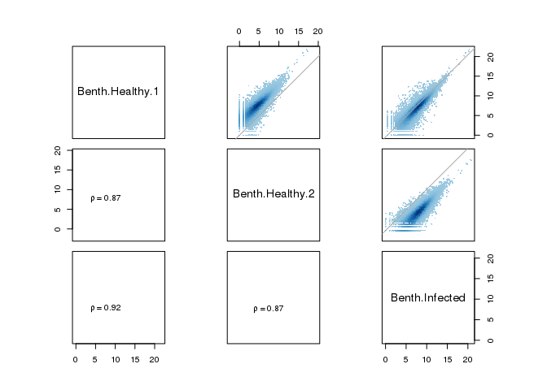

``` r
suppressWarnings(pairs(log2(GRLaV3_vs_Nb), labels=colnames(GRLaV3_vs_Nb), upper.panel=panel.points, lower.panel=panel.corr,
      maTransform=TRUE, xlim=c(0,20), ylim=c(-8,8), pch=16, cex=0.4, asp=1))
```

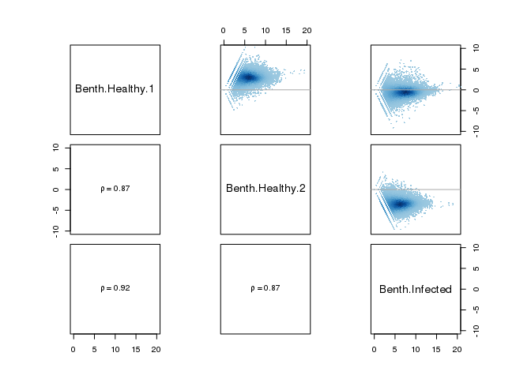

``` r
#plotMDS(log2(GRLaV3_vs_Nb+0.5), top=1000)


## How many samples are 0 in All samples?
# Filtering these has no effect on cpm/rpkm calculations
apply(GRLaV3_vs_Nb==0, 1, all)  %>%  table
```

    ## .
    ## FALSE  TRUE 
    ## 44511 15303

``` r
# set the replicate relationship.. columns 1 and 2 are reps of each other
## Healthy vs Infected
replicate_relationship <- factor(c(1,1,2))
# construct the DGEList object
all_genes <- DGEList(counts=GRLaV3_vs_Nb, group=replicate_relationship)

for( i in seq(ncol(all_genes))) {
  plotMD.DGEList(all_genes, column=i)
  abline(h=0, col="grey", lty=2)
}
```

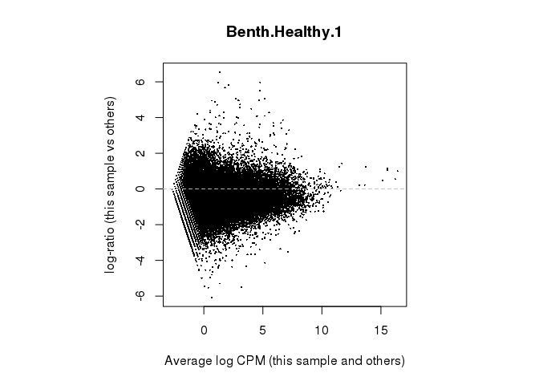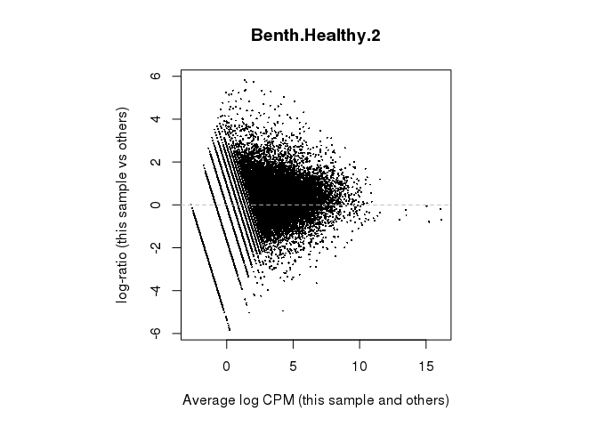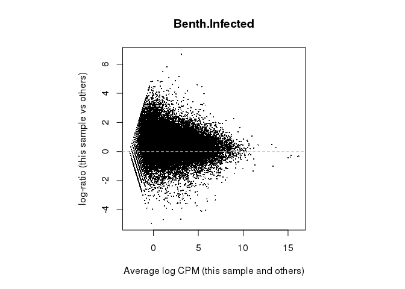

``` r
breaks <- seq(0, ceiling(max(log2(all_genes$counts))))
tweak  <- 1

## Distribution of counts
for(i in colnames(all_genes)) {
  hist(log2(all_genes$counts+tweak)[, i], breaks=breaks, main=i, xlab="log2(counts)")
}
```

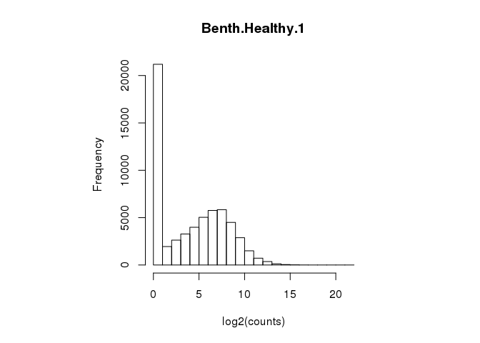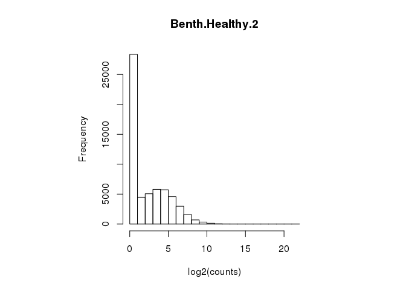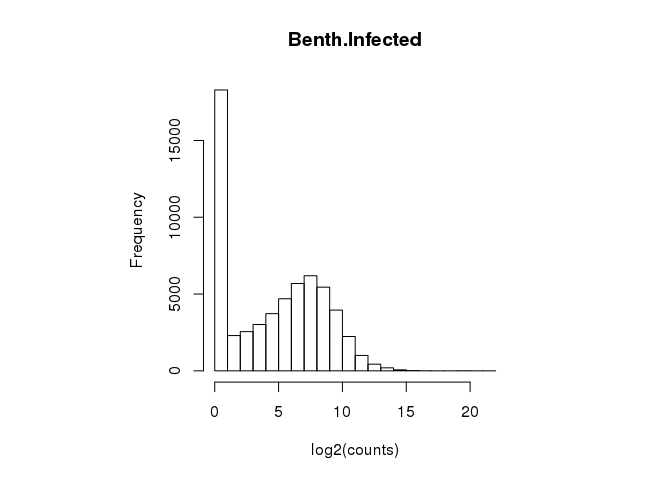

`Healthy.2` replicate is different from the other samples (including the other biological replicate)

The spike in the histograms are the zero counts in each sample.

Filtering
---------

Library normalization factors estimated using trimmed mean of M values (TMM).

Alternative less aggressive filtering of only genes where all data was zero counts was used. In this experiment over filtering has the additional side effect of effecting the misture distribution of modelled raw p-values which should be distibuted Ho: Unif(0,1) , Ha: exp(rate).

``` r
# Calculate normalisation factors
all_genes <- calcNormFactors(all_genes, method="TMM")

# Examine normalisation factors as a sanity check
all_genes$samples
```

    ##                 group lib.size norm.factors
    ## Benth.Healthy.1     1 28216160    0.7439606
    ## Benth.Healthy.2     1  2448120    1.1444213
    ## Benth.Infected      2 26897662    1.1745301

``` r
# We can see that Benth.Healthy2 had a lot less sequencing.

# Nonsensical results can happen if we do not remove genes
# that are not biologically relevant because of low expression
# Filter out low expressed genes on the basis of the count per million
# This filters out genes that are less than cpmlimit, and 
# that are not expressed in libexplimit number of libraries
cpmlimit    <- 1
libexplimit <- 1
keep <- rowSums(cpm(all_genes)>cpmlimit) >= libexplimit

## Visualize
hist(log2(rowSums(cpm(all_genes))))
abline(v=log2(cpmlimit), col="red", lty=2)
```

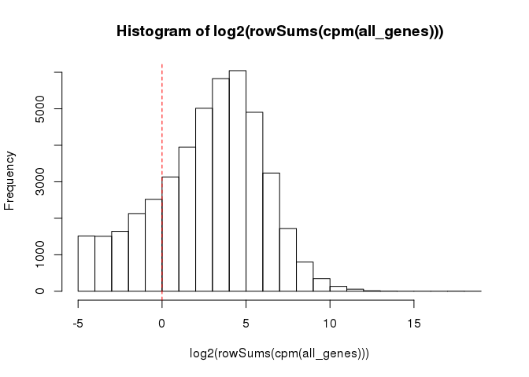

``` r
## Sanity check how many are kept
table(keep)
```

    ## keep
    ## FALSE  TRUE 
    ## 26920 32894

``` r
par(pty="s")

## Visualize filtering
suppressWarnings(pairs(log2(GRLaV3_vs_Nb), labels=colnames(GRLaV3_vs_Nb), upper.panel=panel.points, lower.panel=panel.corr, pch=16, cex=0.1, asp=1, col=c("black","grey")[(keep)+1], main="Filtering effect"))
```

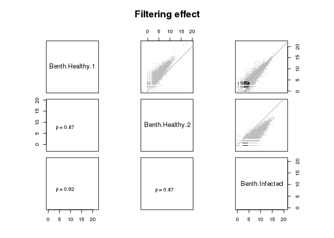

``` r
suppressWarnings(pairs(log2(GRLaV3_vs_Nb), labels=colnames(GRLaV3_vs_Nb), upper.panel=panel.points, lower.panel=panel.corr, maTransform=TRUE, xlim=c(0,20), ylim=c(-8,8), pch=16, cex=0.1, asp=1, col=c("black", "grey")[(keep)+1], main="MAplot Filtering effect"))
```

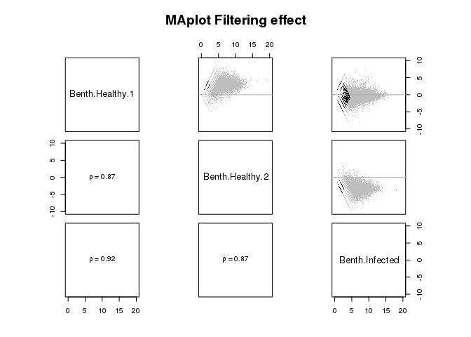

``` r
## Distribution of counts after filtering
for(i in colnames(all_genes)) {
  hist(log2(all_genes$counts+tweak)[keep , i], breaks=breaks, main=i, xlab="log2(counts)")
}
```

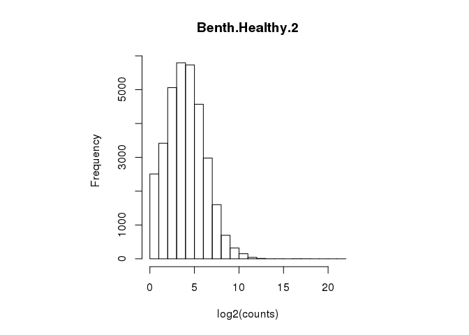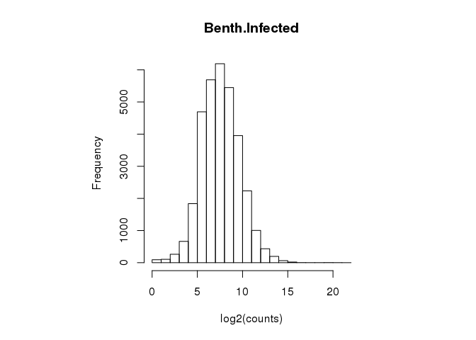

``` r
## Alternative filter which overrides line:89
keep <- !apply(GRLaV3_vs_Nb==0, 1, all)

## Sanity check how many are kept
table(keep)
```

    ## keep
    ## FALSE  TRUE 
    ## 15303 44511

``` r
all_genes_kept <- all_genes[which(keep), keep.lib.sizes=FALSE]

## Sanity check
dim(all_genes)
```

    ## [1] 59814     3

``` r
dim(all_genes_kept)
```

    ## [1] 44511     3

``` r
# Calculate normalisation factors again
all_genes_kept <- calcNormFactors(all_genes_kept, method="TMM")

## Sanity check
apply(GRLaV3_vs_Nb,2, sum)
```

    ## Benth.Healthy.1 Benth.Healthy.2  Benth.Infected 
    ##        28216160         2448120        26897662

``` r
calcNormFactors(all_genes, method="TMM")
```

    ## An object of class "DGEList"
    ## $counts
    ##                        Benth.Healthy.1 Benth.Healthy.2 Benth.Infected
    ## Niben101Ctg00054g00001              55              23             79
    ## Niben101Ctg00074g00004               0               0              0
    ## Niben101Ctg00116g00002              65              17            133
    ## Niben101Ctg00129g00001               0               0              0
    ## Niben101Ctg00141g00002               1               0              1
    ## 59809 more rows ...
    ## 
    ## $samples
    ##                 group lib.size norm.factors
    ## Benth.Healthy.1     1 28216160    0.7439606
    ## Benth.Healthy.2     1  2448120    1.1444213
    ## Benth.Infected      2 26897662    1.1745301

``` r
all_genes_kept$samples
```

    ##                 group lib.size norm.factors
    ## Benth.Healthy.1     1 28216160    0.7439606
    ## Benth.Healthy.2     1  2448120    1.1444213
    ## Benth.Infected      2 26897662    1.1745301

``` r
## Benth.Healthy.2 is an order of magnitude smaller!
apply(GRLaV3_vs_Nb,2, sum)[1] / apply(GRLaV3_vs_Nb,2, sum)[2]
```

    ## Benth.Healthy.1 
    ##        11.52564

Of note here is the `Benth.Healthy.1` sample has 11.5256442 times the library size of `Benth.Healthy.2`. Why are the two libraries so different?

edgeR models
------------

``` r
# Todo: Need to look at underlying bam mapping scores...


# set experiment design
design <- model.matrix(~replicate_relationship)
# estimate dispersion
all_genes_kept <- estimateDisp(all_genes_kept, design)


# Now we test for differential expression using two methods.
# From the edgeR manual:
# "edgeR offers many variants on analyses. The glm approach is more popular than the classic
# approach as it offers great flexibilities. There are two testing methods under the glm framework:
# likelihood ratio test and quasi-likelihood F-test. The quasi-likelihood method is highly
# recommended for differential expression analyses of bulk RNA-seq data as it gives stricter
# error rate control by accounting for the uncertainty in dispersion estimation. The likelihood
# ratio test can be useful in some special cases such as single cell RNA-seq and datasets with
# no replicates."

# Use the glm to obtain DE genes
fitglm <- glmFit(all_genes_kept, design)
lrtglm <- glmLRT(fitglm, coef=2)
topN   <- topTags(lrtglm, n=nrow(lrtglm))


threshold <- 0.05
de_genes  <- topN$table[topN$table$FDR<threshold,]

## DE genes
nrow(de_genes)
```

    ## [1] 157

``` r
## First 10
head(de_genes, n=10)
```

    ##                            logFC   logCPM       LR       PValue
    ## Niben101Scf00107g03008  6.871696 4.682465 63.44245 1.651207e-15
    ## Niben101Scf05044g02012  6.622188 2.769140 43.62283 3.981664e-11
    ## Niben101Scf00837g08001 -6.892654 4.177794 39.93940 2.619653e-10
    ## Niben101Scf03937g00009  5.188397 3.759200 39.49505 3.288917e-10
    ## Niben101Scf06977g00014 -6.624449 6.394987 35.78775 2.200267e-09
    ## Niben101Scf03169g00010 -5.974961 4.342707 34.14388 5.118405e-09
    ## Niben101Scf01475g00019 -6.065090 3.542031 32.77132 1.036629e-08
    ## Niben101Scf03506g03001  4.587492 3.224802 32.41415 1.245758e-08
    ## Niben101Scf02971g01006 -9.719596 1.913830 31.37828 2.123431e-08
    ## Niben101Scf08683g00001 -5.387346 4.306713 29.90128 4.546132e-08
    ##                                 FDR
    ## Niben101Scf00107g03008 7.349687e-11
    ## Niben101Scf05044g02012 8.861393e-07
    ## Niben101Scf00837g08001 3.659824e-06
    ## Niben101Scf03937g00009 3.659824e-06
    ## Niben101Scf06977g00014 1.958722e-05
    ## Niben101Scf03169g00010 3.797089e-05
    ## Niben101Scf01475g00019 6.591628e-05
    ## Niben101Scf03506g03001 6.931239e-05
    ## Niben101Scf02971g01006 1.050178e-04
    ## Niben101Scf08683g00001 2.023529e-04

``` r
## estimate pi0
pvals <- topN$table$PValue

hist(pvals)

## Investigating abnormal right hand peak in pvalue histogram
# ind <- which(pvals>=1)
# rownames(topN$table)[ind]
# GRLaV3_vs_Nb[rownames(topN$table)[ind],]

#pi0_hat <- limma::convest(pvals)
#print(pi0_hat)

# Use the quasi-likelihood model to obtain DE genes.
# From edgeR manual: 
#"While the likelihood ratio test is a more obvious choice for inferences with GLMs, the QL
#F-test is preferred as it reflects the uncertainty in estimating the dispersion for each gene. It
#provides more robust and reliable error rate control when the number of replicates is small"
fitqlm  <- glmQLFit(all_genes_kept, design)
qlftest <- glmQLFTest(fitqlm, coef=2)
topN2   <- topTags(qlftest, n=nrow(lrtglm))

threshold <- 0.05
de_genes2 <- topN2$table[topN2$table$FDR<threshold,]

## DE genes
nrow(de_genes2)
```

    ## [1] 192

``` r
## First 10
head(de_genes2, n=10)
```

    ##                            logFC   logCPM        F       PValue
    ## Niben101Scf00107g03008  6.871688 4.682465 79.73219 4.447203e-19
    ## Niben101Scf00837g08001 -6.892875 4.177794 50.13170 1.458892e-12
    ## Niben101Scf05044g02012  6.622181 2.769140 49.77721 1.747415e-12
    ## Niben101Scf03937g00009  5.188513 3.759200 48.58255 3.210717e-12
    ## Niben101Scf03169g00010 -5.975193 4.342707 43.04653 5.403794e-11
    ## Niben101Scf06977g00014 -6.624507 6.394987 42.22785 8.209053e-11
    ## Niben101Scf01475g00019 -6.065571 3.542031 40.11691 2.414876e-10
    ## Niben101Scf03506g03001  4.587501 3.224802 38.53894 5.414464e-10
    ## Niben101Scf08683g00001 -5.387564 4.306713 37.65900 8.496614e-10
    ## Niben101Scf02175g06018 -5.251927 4.355896 36.51320 1.528372e-09
    ##                                 FDR
    ## Niben101Scf00107g03008 1.979495e-14
    ## Niben101Scf00837g08001 2.592639e-08
    ## Niben101Scf05044g02012 2.592639e-08
    ## Niben101Scf03937g00009 3.572805e-08
    ## Niben101Scf03169g00010 4.810566e-07
    ## Niben101Scf06977g00014 6.089886e-07
    ## Niben101Scf01475g00019 1.535551e-06
    ## Niben101Scf03506g03001 3.012540e-06
    ## Niben101Scf08683g00001 4.202142e-06
    ## Niben101Scf02175g06018 6.802937e-06

``` r
## estimate pi0
pvals <- topN$table$PValue

hist(pvals)
```

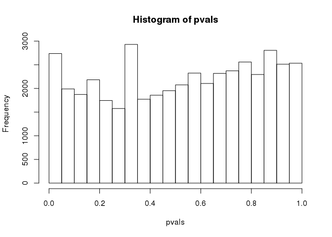

``` r
## Investigating abnormal right hand peak in pvalue histogram
# ind <- which(pvals>=1)
# rownames(topN$table)[ind]
# GRLaV3_vs_Nb[rownames(topN$table)[ind],]

#pi0_hat <- limma::convest(pvals)
#print(pi0_hat)
```
