RNA-Seq aligned against V. vinifera
================
Marcus Davy, Dan Jones

<!-- Note: Rendering of urls in github rmarkdown will not work -->
> The master version of this document is on *[github](https://github.com/PlantandFoodResearch/bioinf_Vitis_Nicotiana_RNAseq)*. This printing is shasum version *[c04984e](https://github.com/PlantandFoodResearch/bioinf_Vitis_Nicotiana_RNAseq/commit/c04984e)* from that repository.

> Rmd =&gt; R files rendered with;

    ## knitr::purl("GRLaV_Vv_EdgeR.Rmd", documentation=2L)

Count data
----------

Checking names in dataset do not contain duplicated names, or missing names. A missing annotation could imply an off by *n* allocation of gene names to count data, which would make all gene look ups after the first position of the mislabeled record meaningless.

``` r
filename <- '/workspace/hradxj/karmun_awesome_experiment/011.edgeR_Vv/GRLaV3_Vv_EdgeR.tab'

GRLaV3_vs_Vv <- read.delim(filename, header=TRUE)
dim(GRLaV3_vs_Vv)
```

    ## [1] 19759     4

``` r
#GRLaV3_vs_Vv2 <- read.table(filename, header=TRUE, sep="\t")

## Sanity check names
## Check for missing Gene names
GRLaV3_vs_Vv[which(GRLaV3_vs_Vv$Gene %in% ""), ]
```

    ## [1] Gene             Grape.Healthy    Grape.Infected.1 Grape.Infected.2
    ## <0 rows> (or 0-length row.names)

``` r
## Duplicated names
badnames <- names(table(GRLaV3_vs_Vv$Gene))[table(GRLaV3_vs_Vv$Gene)>1]
GRLaV3_vs_Vv[which(GRLaV3_vs_Vv$Gene %in% badnames), ]
```

    ## [1] Gene             Grape.Healthy    Grape.Infected.1 Grape.Infected.2
    ## <0 rows> (or 0-length row.names)

``` r
# Row names are not unique for some reason. Crap annotations again.
# Assign unique row names using the preexisting names, but making them
# unique where required by adding ".1, .2" etc.
rownames(GRLaV3_vs_Vv) <- make.names(GRLaV3_vs_Vv[,1], unique=TRUE)

## Sanity check
GRLaV3_vs_Vv[which(GRLaV3_vs_Vv$Gene %in% badnames),]
```

    ## [1] Gene             Grape.Healthy    Grape.Infected.1 Grape.Infected.2
    ## <0 rows> (or 0-length row.names)

``` r
# Remove the redundant column where the row names came from
GRLaV3_vs_Vv[,1] <- NULL
```

Data exploration
----------------

``` r
par(pty="s")

suppressWarnings(pairs(log2(GRLaV3_vs_Vv), labels=colnames(GRLaV3_vs_Vv), upper.panel=panel.points, lower.panel=panel.corr,
      pch=16, cex=0.4, asp=1))
```

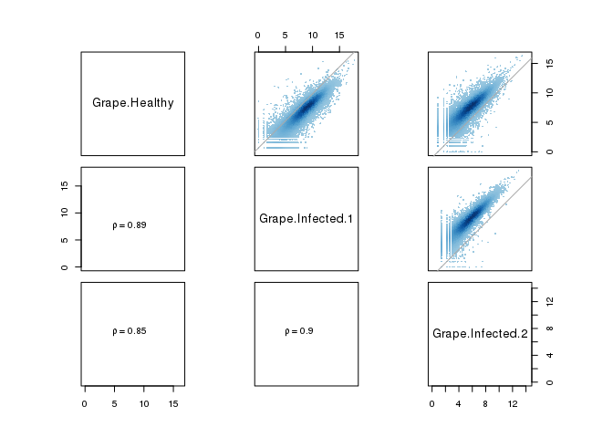

``` r
suppressWarnings(pairs(log2(GRLaV3_vs_Vv), labels=colnames(GRLaV3_vs_Vv), upper.panel=panel.points, lower.panel=panel.corr,
      maTransform=TRUE, xlim=c(0,20), ylim=c(-8,8), pch=16, cex=0.4, asp=1))
```

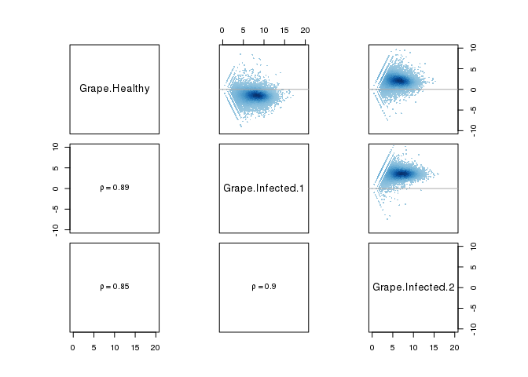

``` r
#plotMDS(log2(GRLaV3_vs_Vv+0.5), top=1000)


## How many samples are 0 in All samples?
# Filtering these has no effect on cpm/rpkm calculations
apply(GRLaV3_vs_Vv==0, 1, all)  %>%  table
```

    ## .
    ## FALSE  TRUE 
    ## 16986  2773

``` r
# set the replicate relationship.. columns 1 and 2 are reps of each other
## Healthy vs Infected
replicate_relationship <- factor(c(1,2,2))
# construct the DGEList object
all_genes <- DGEList(counts=GRLaV3_vs_Vv, group=replicate_relationship)

for( i in seq(ncol(all_genes))) {
  plotMD.DGEList(all_genes, column=i)
  abline(h=0, col="grey", lty=2)
}
```

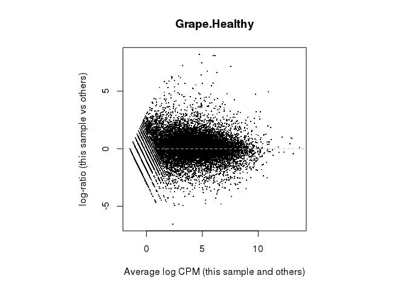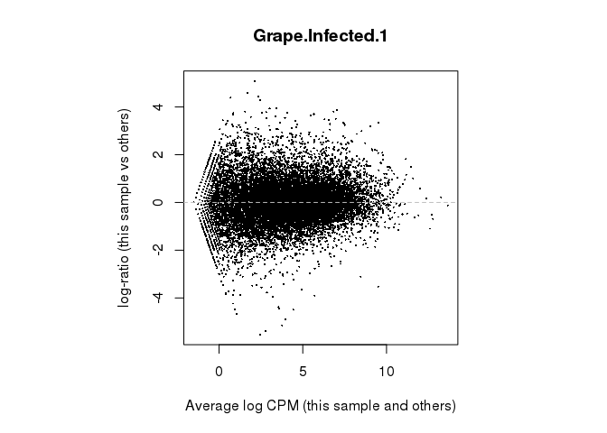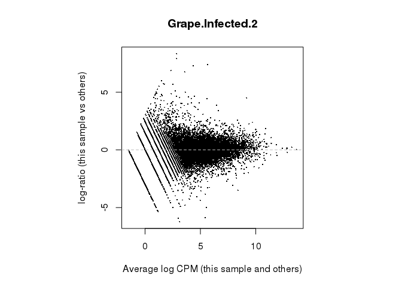

``` r
breaks <- seq(0, ceiling(max(log2(all_genes$counts))))
tweak  <- 1

## Distribution of counts
for(i in colnames(all_genes)) {
  hist(log2(all_genes$counts+tweak)[, i], breaks=breaks, main=i, xlab="log2(counts)")
}
```

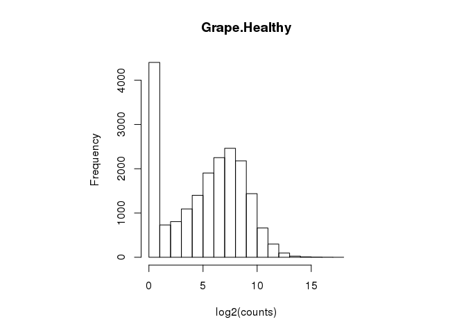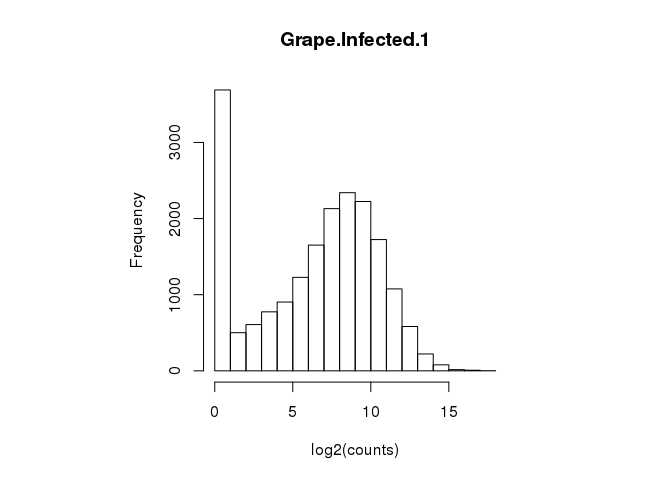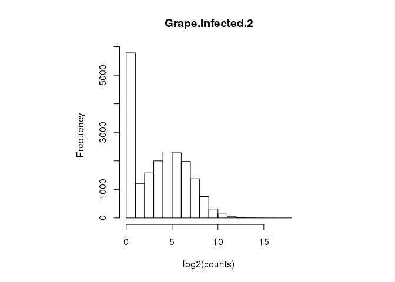

`Grape.Infected.1` replicate is different from the other samples (including the other biological replicate)

The spike in the histograms are the zero counts in each sample.

Filtering
---------

Library normalization factors estimated using trimmed mean of M values (TMM).

Alternative less aggressive filtering of only genes where all data was zero counts was used. In this experiment over filtering has the additional side effect of effecting the mixture distribution of modeled raw p-values which should be distributed Ho: unif(0,1) , Ha: exp(rate).

``` r
# Calculate normalisation factors
all_genes <- calcNormFactors(all_genes, method="TMM")

# Examine normalisation factors as a sanity check
all_genes$samples
```

    ##                  group lib.size norm.factors
    ## Grape.Healthy        1  5845892    1.0267447
    ## Grape.Infected.1     2 18046557    0.9686044
    ## Grape.Infected.2     2  1521236    1.0055208

``` r
# We can see that Benth.Healthy, Grape.Infected.2 had a lot less sequencing.

# Nonsensical results can happen if we do not remove genes
# that are not biologically relevant because of low expression
# Filter out low expressed genes on the basis of the count per million
# This filters out genes that are less than cpmlimit, and 
# that are not expressed in libexplimit number of libraries
cpmlimit    <- 10
libexplimit <- 2
keep <- rowSums(cpm(all_genes)>cpmlimit) >= libexplimit

## Visualize
hist(log2(rowSums(cpm(all_genes))))
abline(v=log2(cpmlimit), col="red", lty=2)
```

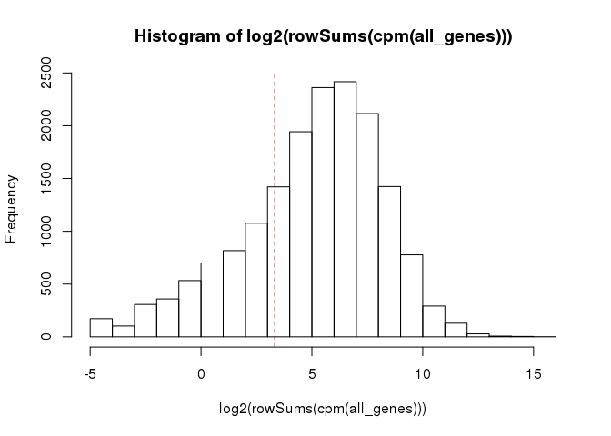

``` r
## Sanity check how many are kept
table(keep)
```

    ## keep
    ## FALSE  TRUE 
    ## 10380  9379

``` r
par(pty="s")

## Visualize filtering
suppressWarnings(pairs(log2(GRLaV3_vs_Vv), labels=colnames(GRLaV3_vs_Vv), upper.panel=panel.points, lower.panel=panel.corr, pch=16, cex=0.1, asp=1, col=c("black","grey")[(keep)+1], main="Filtering effect"))
```

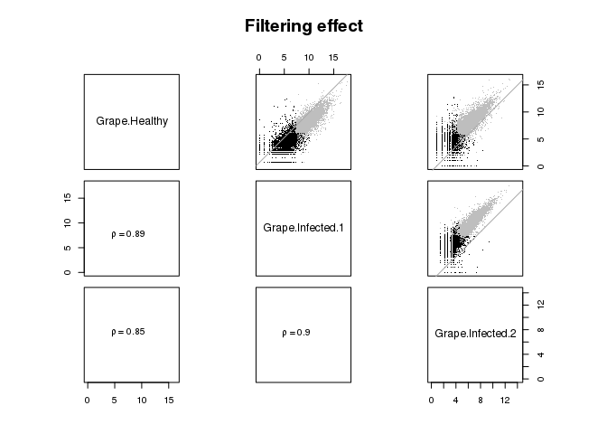

``` r
suppressWarnings(pairs(log2(GRLaV3_vs_Vv), labels=colnames(GRLaV3_vs_Vv), upper.panel=panel.points, lower.panel=panel.corr, maTransform=TRUE, xlim=c(0,20), ylim=c(-8,8), pch=16, cex=0.1, asp=1, col=c("black", "grey")[(keep)+1], main="MAplot Filtering effect"))
```

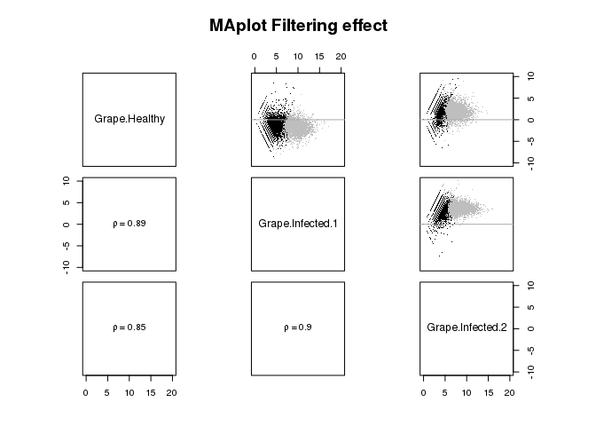

``` r
## Distribution of counts after filtering
for(i in colnames(all_genes)) {
  hist(log2(all_genes$counts+tweak)[keep , i], breaks=breaks, main=i, xlab="log2(counts)")
}
```

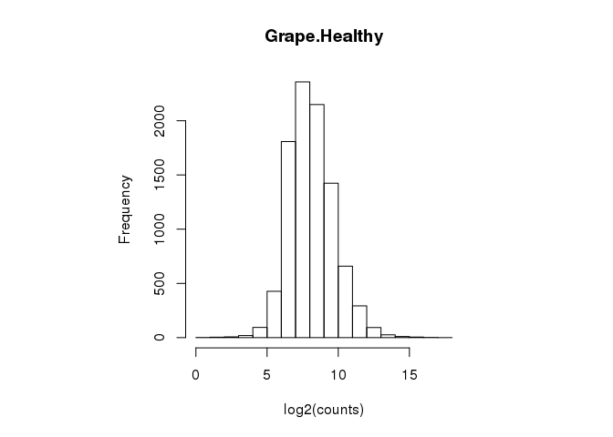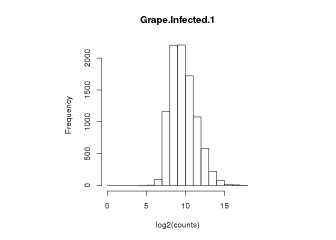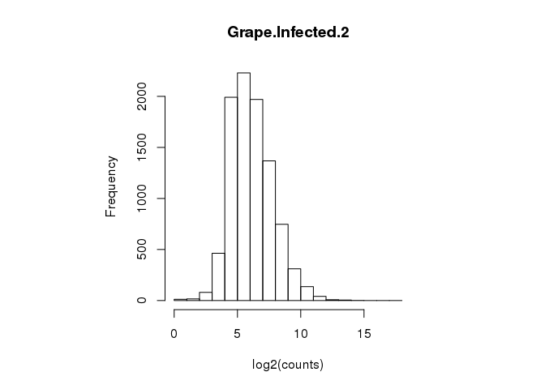

``` r
## Alternative filter which overrides line:89
# keep <- !apply(GRLaV3_vs_Vv==0, 1, all)

## Sanity check how many are kept
# table(keep)

all_genes_kept <- all_genes[which(keep), keep.lib.sizes=FALSE]

## Sanity check
dim(all_genes)
```

    ## [1] 19759     3

``` r
dim(all_genes_kept)
```

    ## [1] 9379    3

``` r
# Calculate normalisation factors again
all_genes_kept <- calcNormFactors(all_genes_kept, method="TMM")

## Sanity check
apply(GRLaV3_vs_Vv,2, sum)
```

    ##    Grape.Healthy Grape.Infected.1 Grape.Infected.2 
    ##          5845892         18046557          1521236

``` r
calcNormFactors(all_genes, method="TMM")
```

    ## An object of class "DGEList"
    ## $counts
    ##                   Grape.Healthy Grape.Infected.1 Grape.Infected.2
    ## GSVIVG01012261001            14               37                1
    ## GSVIVG01012259001             6               18                1
    ## GSVIVG01012257001           311             1151              151
    ## GSVIVG01012255001           755             1819              234
    ## GSVIVG01012253001             1                0                0
    ## 19754 more rows ...
    ## 
    ## $samples
    ##                  group lib.size norm.factors
    ## Grape.Healthy        1  5845892    1.0267447
    ## Grape.Infected.1     2 18046557    0.9686044
    ## Grape.Infected.2     2  1521236    1.0055208

``` r
all_genes_kept$samples
```

    ##                  group lib.size norm.factors
    ## Grape.Healthy        1  5628229    1.0290413
    ## Grape.Infected.1     2 17591761    0.9782519
    ## Grape.Infected.2     2  1480593    0.9933825

``` r
## Grape.Infected.2 is an order of magnitude smaller!
apply(GRLaV3_vs_Vv,2, sum)[2] / apply(GRLaV3_vs_Vv,2, sum)[3]
```

    ## Grape.Infected.1 
    ##         11.86309

Of note here is the `Grape.Infected.1` sample has 11.8630883 times the library size of `Grape.Infected.2`. Why are the two libraries so different?

Filtering out all gene models where no count is observed has no effect on library size estimation.

edgeR models
------------

``` r
# Todo: Need to look at underlying bam mapping scores...


# set experiment design
design <- model.matrix(~replicate_relationship)
# estimate dispersion
all_genes_kept <- estimateDisp(all_genes_kept, design)


# Now we test for differential expression using two methods.
# From the edgeR manual:
# "edgeR offers many variants on analyses. The glm approach is more popular than the classic
# approach as it offers great flexibilities. There are two testing methods under the glm framework:
# likelihood ratio test and quasi-likelihood F-test. The quasi-likelihood method is highly
# recommended for differential expression analyses of bulk RNA-seq data as it gives stricter
# error rate control by accounting for the uncertainty in dispersion estimation. The likelihood
# ratio test can be useful in some special cases such as single cell RNA-seq and datasets with
# no replicates."

# Use the glm to obtain DE genes
fitglm <- glmFit(all_genes_kept, design)
lrtglm <- glmLRT(fitglm, coef=2)
topN   <- topTags(lrtglm, n=nrow(lrtglm))


summary(decideTests(lrtglm))
```

    ##        replicate_relationship2
    ## Down                       222
    ## NotSig                    8885
    ## Up                         272

``` r
plotMD(lrtglm, cex=0.5, main="Infected vs Healthy")
```

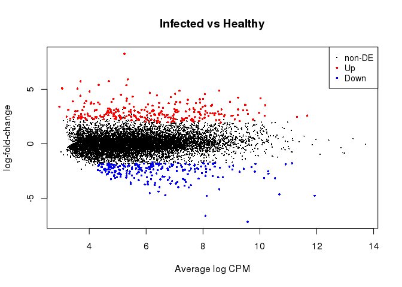

``` r
openDevice("png", file.path(imgDir, "maplot_lrt"))
```

    ## [1] "images/Vv/maplot_lrt.png"

``` r
plotMD(lrtglm, cex=0.5, main="Infected vs Healthy")
dev.off()
```

    ## png 
    ##   2

``` r
openDevice("tiff", file.path(imgDir, "maplot_lrt"))
```

    ## [1] "images/Vv/maplot_lrt.tif"

``` r
plotMD(lrtglm, cex=0.5, main="Infected vs Healthy")
dev.off()
```

    ## png 
    ##   2

``` r
threshold <- 0.05
de_genes  <- topN$table[topN$table$FDR<threshold,]

## DE genes
nrow(de_genes)
```

    ## [1] 494

``` r
## First 10
head(de_genes, n=10)
```

    ##                       logFC    logCPM        LR       PValue          FDR
    ## GSVIVG01028856001 -7.155443  9.571178 111.47956 4.645693e-26 4.357196e-22
    ## GSVIVG01017960001 -6.620759  8.084244  81.51203 1.741978e-19 8.169006e-16
    ## GSVIVG01035900001 -4.764818  8.128116  61.55656 4.302057e-15 1.344966e-11
    ## GSVIVG01026014001 -4.723862  6.672261  59.16300 1.451376e-14 3.403113e-11
    ## GSVIVG01027028001 -4.637934 10.682202  51.96331 5.654749e-13 1.060718e-09
    ## GSVIVG01033388001 -4.384228  6.434971  51.27756 8.018683e-13 1.253454e-09
    ## GSVIVG01017087001 -4.532545  6.127439  50.19270 1.393654e-12 1.867297e-09
    ## GSVIVG01019407001 -4.770217 11.925204  48.92392 2.660855e-12 3.119520e-09
    ## GSVIVG01011496001 -4.188728  8.576402  47.39930 5.790325e-12 6.034162e-09
    ## GSVIVG01005149001 -3.985182  6.472926  43.41146 4.435836e-11 4.160371e-08

``` r
## estimate pi0
pvals <- topN$table$PValue

hist(pvals)
```


``` r
## Investigating abnormal right hand peak in pvalue histogram
# ind <- which(pvals>=1)
# rownames(topN$table)[ind]
# GRLaV3_vs_Vv[rownames(topN$table)[ind],]

if(est_pi0) {
  pi0_hat <- limma::convest(pvals)
  print(pi0_hat)
}
```

    ## [1] 0.8772344

``` r
## Obtaining genes that show zero differential expression
high_expressed_no_de_genes <- subset(topN$table, logFC < 0.01 & logFC > -0.01 & logCPM > 6)
dim(high_expressed_no_de_genes)
```

    ## [1] 44  5

``` r
knitr::kable(high_expressed_no_de_genes)
```

|                   |       logFC|    logCPM|         LR|     PValue|        FDR|
|-------------------|-----------:|---------:|----------:|----------:|----------:|
| GSVIVG01035560001 |   0.0096193|  6.766034|  0.0002545|  0.9872721|  0.9980514|
| GSVIVG01026955001 |   0.0092157|  8.328945|  0.0002482|  0.9874295|  0.9980514|
| GSVIVG01025150001 |   0.0092277|  7.340194|  0.0002448|  0.9875164|  0.9980514|
| GSVIVG01027623001 |  -0.0090247|  8.529010|  0.0002351|  0.9877653|  0.9980878|
| GSVIVG01023149001 |  -0.0086300|  7.397486|  0.0002154|  0.9882914|  0.9984042|
| GSVIVG01007667001 |  -0.0086422|  6.603043|  0.0002083|  0.9884852|  0.9984925|
| GSVIVG01020148001 |  -0.0079954|  6.695240|  0.0001855|  0.9891339|  0.9987354|
| GSVIVG01016172001 |  -0.0079864|  6.363361|  0.0001708|  0.9895737|  0.9987518|
| GSVIVG01037389001 |   0.0072654|  8.842384|  0.0001454|  0.9903782|  0.9987518|
| GSVIVG01032481001 |   0.0068749|  7.400257|  0.0001316|  0.9908485|  0.9988192|
| GSVIVG01024351001 |   0.0066438|  6.595527|  0.0001286|  0.9909534|  0.9988192|
| GSVIVG01016175001 |  -0.0068956|  8.372377|  0.0001235|  0.9911316|  0.9988192|
| GSVIVG01011157001 |  -0.0064873|  6.181025|  0.0001230|  0.9911516|  0.9988192|
| GSVIVG01026933001 |  -0.0060020|  8.514981|  0.0001018|  0.9919501|  0.9988835|
| GSVIVG01024906001 |  -0.0056081|  7.044063|  0.0000896|  0.9924458|  0.9988835|
| GSVIVG01020909001 |  -0.0052810|  6.437810|  0.0000815|  0.9927967|  0.9988835|
| GSVIVG01023097001 |   0.0053598|  7.737012|  0.0000813|  0.9928077|  0.9988835|
| GSVIVG01012108001 |  -0.0045944|  7.762512|  0.0000601|  0.9938132|  0.9991259|
| GSVIVG01023279001 |   0.0043907|  6.632207|  0.0000559|  0.9940340|  0.9991259|
| GSVIVG01018976001 |  -0.0043287|  7.409126|  0.0000541|  0.9941303|  0.9991259|
| GSVIVG01013410001 |  -0.0042449|  6.319190|  0.0000534|  0.9941687|  0.9991259|
| GSVIVG01024872001 |  -0.0044438|  6.913532|  0.0000476|  0.9944966|  0.9991259|
| GSVIVG01028110001 |  -0.0039417|  6.118935|  0.0000434|  0.9947412|  0.9991259|
| GSVIVG01028469001 |   0.0037043|  7.556680|  0.0000377|  0.9950986|  0.9991259|
| GSVIVG01031917001 |   0.0033651|  8.046064|  0.0000330|  0.9954164|  0.9991259|
| GSVIVG01003431001 |   0.0032718|  6.984425|  0.0000298|  0.9956428|  0.9991259|
| GSVIVG01022134001 |  -0.0029792|  7.079454|  0.0000257|  0.9959585|  0.9991259|
| GSVIVG01014611001 |  -0.0029376|  7.922877|  0.0000251|  0.9960030|  0.9991259|
| GSVIVG01018981001 |  -0.0027370|  9.127035|  0.0000214|  0.9963076|  0.9992104|
| GSVIVG01030215001 |  -0.0027176|  8.572273|  0.0000211|  0.9963339|  0.9992104|
| GSVIVG01038192001 |  -0.0022813|  6.106554|  0.0000150|  0.9969058|  0.9995702|
| GSVIVG01015776001 |  -0.0020566|  8.135706|  0.0000110|  0.9973519|  0.9995791|
| GSVIVG01014274001 |   0.0018921|  6.190281|  0.0000103|  0.9974376|  0.9995791|
| GSVIVG01027421001 |  -0.0017354|  6.016956|  0.0000086|  0.9976594|  0.9995791|
| GSVIVG01026078001 |  -0.0015889|  6.029026|  0.0000072|  0.9978525|  0.9995791|
| GSVIVG01028918001 |  -0.0014499|  6.579718|  0.0000061|  0.9980266|  0.9995791|
| GSVIVG01029990001 |   0.0013799|  6.008549|  0.0000046|  0.9982967|  0.9995791|
| GSVIVG01028366001 |  -0.0008574|  6.234964|  0.0000022|  0.9988265|  0.9995791|
| GSVIVG01017246001 |  -0.0008402|  6.669017|  0.0000020|  0.9988790|  0.9995791|
| GSVIVG01034612001 |   0.0008242|  9.928666|  0.0000019|  0.9988984|  0.9995791|
| GSVIVG01032056001 |   0.0004471|  7.096361|  0.0000006|  0.9993934|  0.9995791|
| GSVIVG01016775001 |   0.0004009|  8.513735|  0.0000005|  0.9994546|  0.9995791|
| GSVIVG01028140001 |  -0.0003998|  7.817238|  0.0000005|  0.9994578|  0.9995791|
| GSVIVG01019440001 |   0.0003496|  6.430739|  0.0000004|  0.9995250|  0.9995791|

``` r
# Use the quasi-likelihood model to obtain DE genes.
# From edgeR manual: 
#"While the likelihood ratio test is a more obvious choice for inferences with GLMs, the QL
#F-test is preferred as it reflects the uncertainty in estimating the dispersion for each gene. It
#provides more robust and reliable error rate control when the number of replicates is small"
fitglm <- glmQLFit(all_genes_kept, design)
qlfglm <- glmQLFTest(fitglm, coef=2)
topN2  <- topTags(qlfglm, n=nrow(qlfglm))


summary(decideTests(qlfglm))
```

    ##        replicate_relationship2
    ## Down                       135
    ## NotSig                    9105
    ## Up                         139

``` r
plotMD(lrtglm, cex=0.5, main="Infected vs Healthy")
```


``` r
openDevice("png", file.path(imgDir, "maplot_ql"))
```

    ## [1] "images/Vv/maplot_ql.png"

``` r
plotMD(lrtglm, cex=0.5, main="Infected vs Healthy")
dev.off()
```

    ## png 
    ##   2

``` r
openDevice("tiff", file.path(imgDir, "maplot_ql"))
```

    ## [1] "images/Vv/maplot_ql.tif"

``` r
plotMD(lrtglm, cex=0.5, main="Infected vs Healthy")
dev.off()
```

    ## png 
    ##   2

``` r
threshold <- 0.05
de_genes2 <- topN2$table[topN2$table$FDR<threshold,]

## DE genes
nrow(de_genes2)
```

    ## [1] 274

``` r
## First 10
head(de_genes2, n=10)
```

    ##                       logFC   logCPM         F       PValue          FDR
    ## GSVIVG01028856001 -7.154303 9.571178 136.37533 1.334937e-08 0.0001252038
    ## GSVIVG01017960001 -6.644303 8.084244  96.01189 1.208468e-07 0.0005667113
    ## GSVIVG01035900001 -4.764070 8.128116  81.90847 3.185049e-07 0.0008096809
    ## GSVIVG01026014001 -4.724850 6.672261  80.81827 3.453165e-07 0.0008096809
    ## GSVIVG01033388001 -4.384892 6.434971  67.56378 1.002384e-06 0.0018802711
    ## GSVIVG01017087001 -4.533882 6.127439  63.41298 1.451461e-06 0.0022688752
    ## GSVIVG01011496001 -4.188637 8.576402  60.42399 1.919098e-06 0.0025526102
    ## GSVIVG01026942001 -3.844252 7.354024  58.21496 2.376654e-06 0.0025526102
    ## GSVIVG01005149001 -3.984124 6.472926  57.15654 2.639316e-06 0.0025526102
    ## GSVIVG01004352001 -3.799065 7.575296  56.84949 2.721623e-06 0.0025526102

``` r
## estimate pi0
pvals2 <- topN2$table$PValue

hist(pvals2)
```

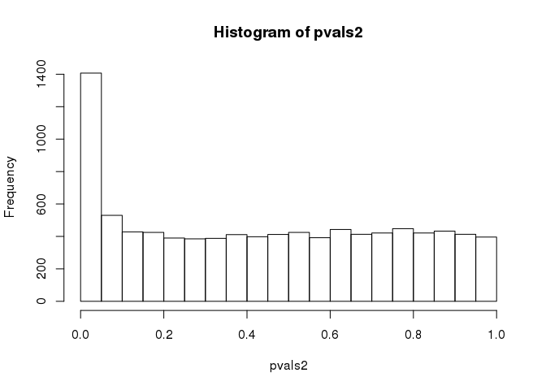

``` r
## Investigating abnormal right hand peak in pvalue histogram
# ind <- which(pvals>=1)
# rownames(topN$table)[ind]
# GRLaV3_vs_Vv[rownames(topN$table)[ind],]

if(est_pi0) {
  pi0_hat2 <- limma::convest(pvals2)
  print(pi0_hat2)
}
```

    ## [1] 0.833443

``` r
## Obtaining genes that show zero differential expression
high_expressed_no_de_genes <- subset(topN2$table, logFC < 0.01 & logFC > -0.01 & logCPM > 6)
dim(high_expressed_no_de_genes)
```

    ## [1] 44  5

``` r
knitr::kable(high_expressed_no_de_genes)
```

|                   |       logFC|    logCPM|          F|     PValue|        FDR|
|-------------------|-----------:|---------:|----------:|----------:|----------:|
| GSVIVG01035560001 |   0.0097809|  6.766034|  0.0003477|  0.9853865|  0.9965800|
| GSVIVG01025150001 |   0.0093373|  7.340194|  0.0003394|  0.9855628|  0.9965800|
| GSVIVG01026955001 |   0.0092510|  8.328945|  0.0003310|  0.9857418|  0.9965800|
| GSVIVG01027623001 |  -0.0090853|  8.529010|  0.0003114|  0.9861692|  0.9967414|
| GSVIVG01023149001 |  -0.0086895|  7.397486|  0.0002961|  0.9865146|  0.9969314|
| GSVIVG01007667001 |  -0.0088476|  6.603043|  0.0002883|  0.9866934|  0.9970047|
| GSVIVG01020148001 |  -0.0080940|  6.695240|  0.0002561|  0.9874567|  0.9974206|
| GSVIVG01016172001 |  -0.0083043|  6.363361|  0.0002369|  0.9879377|  0.9974919|
| GSVIVG01037389001 |   0.0073093|  8.842384|  0.0001866|  0.9892950|  0.9975508|
| GSVIVG01032481001 |   0.0067392|  7.400257|  0.0001687|  0.9898205|  0.9976953|
| GSVIVG01024351001 |   0.0065628|  6.595527|  0.0001686|  0.9898235|  0.9976953|
| GSVIVG01011157001 |  -0.0063526|  6.181025|  0.0001557|  0.9902205|  0.9978810|
| GSVIVG01016175001 |  -0.0067277|  8.372377|  0.0001483|  0.9904548|  0.9979027|
| GSVIVG01024906001 |  -0.0057964|  7.044063|  0.0001291|  0.9910962|  0.9980208|
| GSVIVG01026933001 |  -0.0059309|  8.514981|  0.0001289|  0.9911020|  0.9980208|
| GSVIVG01020909001 |  -0.0055242|  6.437810|  0.0001189|  0.9914556|  0.9980532|
| GSVIVG01023097001 |   0.0054848|  7.737012|  0.0001137|  0.9916411|  0.9981035|
| GSVIVG01012108001 |  -0.0047132|  7.762512|  0.0000847|  0.9927848|  0.9981035|
| GSVIVG01013410001 |  -0.0043896|  6.319190|  0.0000759|  0.9931709|  0.9981035|
| GSVIVG01018976001 |  -0.0044008|  7.409126|  0.0000758|  0.9931756|  0.9981035|
| GSVIVG01023279001 |   0.0042513|  6.632207|  0.0000705|  0.9934208|  0.9981710|
| GSVIVG01028110001 |  -0.0042765|  6.118935|  0.0000664|  0.9936111|  0.9981710|
| GSVIVG01028469001 |   0.0038012|  7.556680|  0.0000527|  0.9943112|  0.9984745|
| GSVIVG01031917001 |   0.0033495|  8.046064|  0.0000438|  0.9948144|  0.9988070|
| GSVIVG01029990001 |   0.0038313|  6.008549|  0.0000429|  0.9948667|  0.9988070|
| GSVIVG01022134001 |  -0.0030442|  7.079454|  0.0000363|  0.9952758|  0.9988196|
| GSVIVG01003431001 |   0.0030903|  6.984425|  0.0000355|  0.9953309|  0.9988196|
| GSVIVG01014611001 |  -0.0029613|  7.922877|  0.0000343|  0.9954117|  0.9988196|
| GSVIVG01024872001 |  -0.0031472|  6.913532|  0.0000299|  0.9957124|  0.9989640|
| GSVIVG01030215001 |  -0.0027859|  8.572273|  0.0000288|  0.9957911|  0.9989640|
| GSVIVG01018981001 |  -0.0027540|  9.127035|  0.0000274|  0.9958960|  0.9989640|
| GSVIVG01014274001 |   0.0022357|  6.190281|  0.0000189|  0.9965899|  0.9989937|
| GSVIVG01015776001 |  -0.0022232|  8.135706|  0.0000164|  0.9968252|  0.9989937|
| GSVIVG01038192001 |  -0.0020540|  6.106554|  0.0000160|  0.9968634|  0.9989937|
| GSVIVG01027421001 |  -0.0019762|  6.016956|  0.0000146|  0.9970060|  0.9990298|
| GSVIVG01028918001 |  -0.0015929|  6.579718|  0.0000099|  0.9975326|  0.9993439|
| GSVIVG01026078001 |  -0.0014049|  6.029026|  0.0000074|  0.9978661|  0.9994646|
| GSVIVG01028366001 |  -0.0009041|  6.234964|  0.0000032|  0.9986009|  0.9996668|
| GSVIVG01034612001 |   0.0008257|  9.928666|  0.0000023|  0.9988202|  0.9996749|
| GSVIVG01019440001 |   0.0006214|  6.430739|  0.0000015|  0.9990426|  0.9996749|
| GSVIVG01017246001 |  -0.0006070|  6.669017|  0.0000014|  0.9990839|  0.9996749|
| GSVIVG01016775001 |   0.0004380|  8.513735|  0.0000007|  0.9993298|  0.9996749|
| GSVIVG01032056001 |   0.0003790|  7.096361|  0.0000006|  0.9994118|  0.9996749|
| GSVIVG01028140001 |  -0.0003240|  7.817238|  0.0000004|  0.9994995|  0.9996749|
